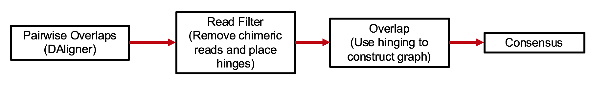

# HINGE  
Software accompanying  "HINGE: Long-Read Assembly Achieves Optimal Repeat Resolution"

- Preprint: http://biorxiv.org/content/early/2016/08/01/062117

- An ipython notebook to reproduce results in the paper can be found in this [repository](https://github.com/govinda-kamath/HINGE-analyses).

CI Status: 


## Introduction 

HINGE is a long read assembler based on an idea called _hinging_.

## Pipeline Overview

HINGE is an OLC(Overlap-Layout-Consensus) assembler. The idea of the pipeline is shown below. 



At a high level, the algorithm can be thought of a variation of the classical greedy algorithm.
The main difference with the greedy algorithm is that rather than each read having a single successor,
and a single predecessor, we allow a small subset of reads to have a higher number of successors/predecessors.
This subset is identified by a process called _hinging_. This helps us to recover the graph structure
directly during assembly.

Another significant difference from HGAP or Falcon pipeline is that it does not have a pre-assembly or read correction step. 


## Algorithm Details

### Reads filtering
Reads filtering filters reads that have long chimer in the middle, and short reads.
Reads which can have higher number of predecessors/successors are also identified there. 
This is implemented in `filter/filter.cpp`

### Layout 
The layout is implemented in `layout/hinging.cpp`. It is done by a variant of the greedy algorithm.

The graph output by the layout stage  is post-processed by running `scripts/pruning_and_clipping.py`.
One output is a graphml file which is the graph representation of the backbone.
This removes dead ends and Z-structures from the graph enabling easy condensation.
It can be analyzed and visualized, etc. 


## Parameters

In the pipeline described above, several programs load their parameters from a configuration file in the ini format.  All tunable parameters are described in [this document](parameter_description.md).


# Installation

## Dependencies
- g++ 4.9
- cmake 3.x
- libhdf5
- boost
- Python 2.7

The following python packages are necessary:
- numpy
- ujson
- configparser
- colormap
- easydev.tools

This software is still at prototype stage so it is not well packaged, however it is designed in a modular flavor so different combinations of methods can be tested. 

Installing the software is very easy. 

```
git clone https://github.com/fxia22/HINGE.git
git submodule init
git submodule update
./utils/build.sh
```

# Running

In order to call the programs from anywhere, I suggest one export the directory of binary file to system environment, you can do that by using the script `setup.sh`. The parameters are initialised in `utils/nominal.ini`. The path to nominal.ini has to be specified to run the scripts.

A demo run for assembling the ecoli genome is the following:

```
source utils/setup.sh
mkdir data/ecoli
cd data/ecoli
# reads.fasta should be in data/ecoli
fasta2DB ecoli reads.fasta
DBsplit -x500 -s100 ecoli     
HPC.daligner -t5 ecoli | csh -v
# alternatively, you can put output of HPC.daligner to a bash file and edit it to support 
rm ecoli.*.ecoli.*
LAmerge ecoli.las ecoli.+([[:digit:]]).las
rm ecoli.*.las # we only need ecoli.las
DASqv -c100 ecoli ecoli.las

# Run filter

mkdir log
hinge filter --db ecoli --las ecoli.las -x ecoli --config <path-to-nominal.ini>

# Get maximal reads

hinge maximal --db ecoli --las ecoli.las -x ecoli --config <path-to-nominal.ini>

# Run layout

hinge layout --db ecoli --las ecoli.las -x ecoli --config <path-to-nominal.ini> -o ecoli

# Run postprocessing

hinge clip ecoli.edges.hinges ecoli.hinge.list <identifier-of-run>


# get draft assembly 

hinge draft-path <working directory> ecoli ecoli<identifier-of-run>.G2.graphml
hinge draft --db ecoli --las ecoli.las --prefix ecoli --config <path-to-nominal.ini> --out ecoli.draft


# get consensus assembly

hinge correct-head ecoli.draft.fasta ecoli.draft.pb.fasta draft_map.txt
fasta2DB draft ecoli.draft.pb.fasta 
HPC.daligner ecoli draft | zsh -v  
hinge consensus draft ecoli draft.ecoli.las ecoli.consensus.fasta <path-to-nominal.ini>
hinge gfa <working directory> ecoli ecoli.consensus.fasta

#results should be in ecoli_consensus.gfa
```


## Analysis of Results

### showing ground truth on graph
Some programs are for debugging and oberservation. For example, one can get the ground truth by mapping reads to reference and get `ecoli.ecoli.ref.las`.

This `las` file can be parsed to json file for other programs to use. 

```
run_mapping.py ecoli ecoli.ref ecoli.ecoli.ref.las 1-$ 
```

In the prune step, if `ecoli.mapping.json` exists, the output `graphml` file will contain the information of ground truth. 

### drawing alignment graphs and mapping graphs
Draw a read, for example 60947, and output figure to `sample` folder (need plus 1 as LAshow counts from 1):

```
draw2.py ecoli ecoli.las 60948 sample 100
```

Draw pileup on draft assembly, given a region(start,end):

```
draw2_pileup_region.py  3600000 4500000 
```

# Results:

For ecoli 160X dataset,  after shortening reads to have a mean length of 3500 (with a variance of 1500), the graph is preserved.


Results on the bacterial genomes of the [NCTC 3000](http://www.sanger.ac.uk/resources/downloads/bacteria/nctc/) project can be found at [web.stanford.edu/~gkamath/NCTC/report.html](https://web.stanford.edu/~gkamath/NCTC/report.html)
